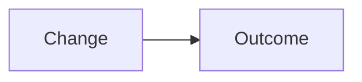

## Summary

<!-- 1–3 bullets: what changed and why -->

-

## Changes

<!-- Optional: call out notable areas (backend, UI, i18n, CI, migrations) -->

-

## Diagrams

<!-- Optional: Mermaid when it clarifies architecture or flows -->

## Test plan

- [ ]
- [ ]

## Notes

<!-- Migrations, env vars, follow-ups, out of scope -->
