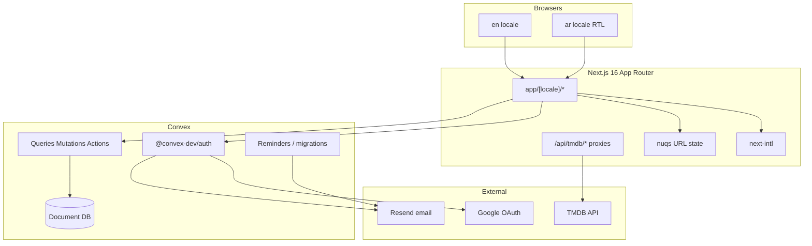
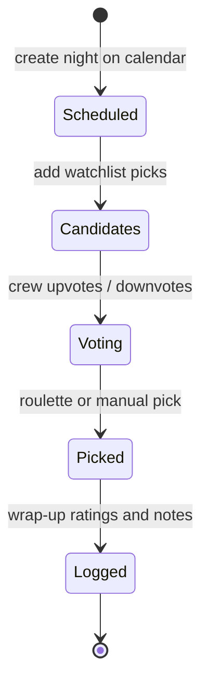
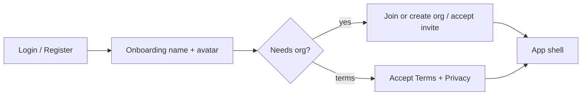
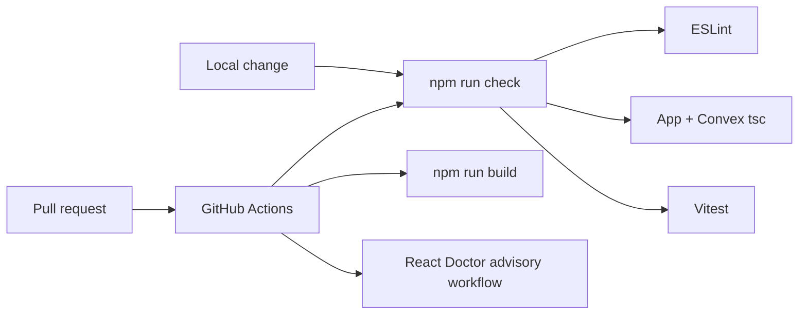

# MOVINIGHT

**Track movies with your crew.** Vote the watchlist, schedule the night, spin the wheel, rate what you watched — then argue about it forever on the Hall of Fame.

MOVINIGHT is a real-time group movie tracker for friends who already have a ritual: pick something, watch together, keep score. It is built as a bilingual (English / Arabic) Next.js app on Convex, with organizations, invites, curated collections, and even a “where do we eat?” board for after the credits.

> Live product orientation: [whopickedthis.app](https://www.whopickedthis.app) · Repo: `movie-night`

---

## Why it exists

Shared lists in chat die. Spreadsheets get ignored. Someone always “forgets” who suggested what.

MOVINIGHT keeps the crew’s **watchlist, votes, calendar nights, ratings, and bragging rights** in one place that updates for everyone at once. The product assumption is small: you are not running a cinema — you are running a recurring hangout with opinions.

---

## What you can do

| Area | What it covers |
| --- | --- |
| **Watchlist** | Search TMDB, add titles, upvote / downvote, filter & sort. Query state (`q`, `sort`, `page`) lives in the URL via `nuqs`. |
| **Movie nights** | Schedule on the calendar, pull candidates, vote, spin the roulette, wrap up with ratings. |
| **Watched history** | Poster grid of everything logged — personal notes, group averages, search. |
| **Collections** | Curated lists for moods and occasions (seeded + crew-owned). |
| **Hall of Fame** | Leaderboards, charts, roasts — the year so far, weaponized. |
| **Food** | “Where should we eat tonight?” — restaurants by city, category, price, votes. |
| **Crew & orgs** | Organizations with join codes and email invites; profiles, avatars, ownership. |
| **Locales** | Full UI in **English** and **Arabic** (RTL) via `next-intl`. |
| **Trust** | Cookie consent, Terms / Privacy / FAQ, PDPL-aware onboarding gates. |

---

## Architecture at a glance



**Data rule of thumb:** Convex owns reactive server state. The Next.js app owns routing, i18n, TMDB HTTP proxies, and ephemeral UI. URL query params own shareable filter/pagination state on the watchlist — not a second client store.

---

## Night lifecycle

How a typical movie night moves through the product:



1. **Schedule** — pick a date on the calendar.
2. **Candidates** — pull from the shared watchlist (or search TMDB).
3. **Decide** — vote, then spin the wheel if the room is deadlocked.
4. **Log** — mark watched, rate, optionally roast forever on Hall of Fame.

---

## Auth and organization gate

New members do not land on an empty dashboard. They complete a short gate so the crew stays private and legally clear:



- **Google OAuth** and **email OTP / password** via `@convex-dev/auth`
- **Org join code** or **invite token** links
- Optional **app owner** email (`APP_OWNER_EMAIL`) for admin capabilities

---

## Tech stack

| Layer | Choice | Why it fits |
| --- | --- | --- |
| App | **Next.js 16** App Router + React 19 | Locale segments, Route Handlers, RSC where useful |
| Backend | **Convex** | Realtime queries, typed functions, scheduled jobs |
| Auth | **@convex-dev/auth** | Google + email without a separate auth service |
| UI | **shadcn/ui** (new-york) + **Tailwind 4** | Consistent Field-based forms; no RHF/Zod in app forms |
| i18n | **next-intl** (`en` / `ar`) | Messages under `messages/{locale}/` |
| URL state | **nuqs** | Watchlist filters are shareable and refresh-safe |
| Movies | **TMDB** via `/api/tmdb/*` | Keys stay server-side |
| Motion | **Framer Motion** (`LazyMotion`) | Roulette, auth stage, pickers |
| Quality | ESLint + Convex plugin, Vitest, `convex-test`, React Doctor, Husky | Lint → types → tests → build in CI |

**Hard project bans (by design):** do not introduce Zod or react-hook-form for product forms — use shadcn `Field` + local state.

---

## Repository map

```text
app/[locale]/          Locale-aware pages (en | ar)
  (auth)/              Login & register
  watchlist/           Shared queue + votes (nuqs)
  watched/             History grid
  calendar/            Night scheduling
  night/[id]/          Room: candidates, roulette, wrap-up
  collections/         Curated lists
  hall-of-fame/        Leaderboards & charts
  food/                Post-movie dinner board
  profile/[id]/        Crew profiles
  org/settings/        Organization admin
  invite/[token]/      Invite acceptance
  join-org/            Create / join by code
  onboarding/          Name + avatar
  about|faq|terms|…    Legal & docs

app/api/tmdb/          Server proxies to TMDB

components/            App shell, cards, search, UI primitives
convex/                Schema, auth, domain modules, migrations
messages/{en,ar}/      next-intl catalogs
i18n/                  Routing + navigation helpers
lib/                   Locale, ratings, TMDB helpers, consent
```

---

## Getting started

### Prerequisites

- **Node.js 22** (CI uses 22; 20+ is usually fine locally)
- A [Convex](https://www.convex.dev) account
- [TMDB](https://www.themoviedb.org/settings/api) API key **and** read access token
- Google OAuth client (for Google sign-in)
- Optional: [Resend](https://resend.com) API key (OTP + night reminders)

### 1. Install

```bash
git clone https://github.com/MOHKSADAH/MOVINIGHT.git
cd MOVINIGHT   # or movie-night locally
npm install
cp .env.example .env.local
```

### 2. Configure environment

Fill `.env.local` from [`.env.example`](.env.example). At minimum:

| Variable | Where | Purpose |
| --- | --- | --- |
| `NEXT_PUBLIC_CONVEX_URL` | Next | Convex client |
| `CONVEX_DEPLOYMENT` | Next / CLI | Dev deployment id from `npx convex dev` |
| `TMDB_ACCESS_TOKEN` | Next | Bearer for `/api/tmdb/*` |
| `TMDB_API_KEY` | Next / Convex as needed | TMDB REST |
| `AUTH_GOOGLE_ID` / `AUTH_GOOGLE_SECRET` | Convex dashboard | Google OAuth |
| `AUTH_RESEND_KEY` | Convex dashboard | Email |
| `SITE_URL` | Convex + Next | OAuth redirects, reminder links |
| `APP_OWNER_EMAIL` | Convex | Optional app owner |

Convex-only secrets also belong in the **Convex dashboard** (Deployment → Environment Variables) so `npx convex dev` and production actions can see them.

### 3. Run Convex + Next

Use two terminals:

```bash
# Terminal A — backend (watches convex/, syncs schema)
npx convex dev

# Terminal B — frontend
npm run dev
```

Open [http://localhost:3000](http://localhost:3000). You will be routed through locale + auth (for example `/en/login`) until signed in.

> Prefer `npx convex dev` while developing. Use `npx convex deploy` only for production.

---

## Scripts

| Command | What it does |
| --- | --- |
| `npm run dev` | Next.js dev server |
| `npx convex dev` | Convex backend watcher |
| `npm run build` | Production Next build |
| `npm run lint` | ESLint (Next + Convex plugin) |
| `npm run typecheck` | App `tsc --noEmit` |
| `npm run typecheck:convex` | Convex `tsc` |
| `npm test` | Vitest unit suite |
| `npm run test:watch` | Vitest watch mode |
| `npm run check` | Lint + both typechecks + tests |
| `npm run doctor` | React Doctor scan |

---

## Quality gates



- **CI** (`.github/workflows/ci.yml`): lint → typecheck → typecheck:convex → **test** → **build**
- **React Doctor** (`.github/workflows/react-doctor.yml`): advisory score / PR comments (non-blocking by default)
- **Husky**: pre-commit lint via `prepare`
- **Unit tests today:** pagination helpers, org-code normalization, movie query/auth rejection (`convex-test`), TMDB search Route Handler

Forms stay **shadcn Field + local state** — that is intentional, not an oversight.

---

## Internationalization

- Locales: `en`, `ar` (RTL) under `app/[locale]/`
- Copy: `messages/en/*.json` and `messages/ar/*.json`
- Navigation helpers: `i18n/navigation.ts` (locale-aware `Link` / `useRouter`)
- Movie titles/overviews prefer Arabic fields when present and locale is `ar`

---

## Contributing

1. Branch from an up-to-date `main`.
2. Keep commits **subject-only**, under 100 characters, no AI attribution trailers.
3. Prefer focused commits when a change spans distinct concerns.
4. Run `npm run check` (and `npm run build` for risky UI/routing work) before opening a PR.
5. Use the PR template (Summary, Changes, Diagrams, Test plan, Notes).

Pull requests that change Convex schema or auth should call out migrations and dashboard env vars explicitly.

---

## Design notes

- Dark-first UI with a light theme toggle; fonts are expressive (Chakra Petch / IBM Plex family), not a default system stack.
- Motion is purposeful (auth stage, roulette, pickers) and respects reduced-motion where wired.
- Accessibility work is ongoing (labeled controls, keyboard-friendly cards, React Doctor a11y passes).

---

## License & credits

Private project by **Mohammad Al-Sadah**. Movie metadata and imagery courtesy of [TMDB](https://www.themoviedb.org/). This product uses the TMDB API but is not endorsed or certified by TMDB.

---

<p align="center">
  <strong>MOVINIGHT</strong><br />
  <em>Who picked this?</em>
</p>
